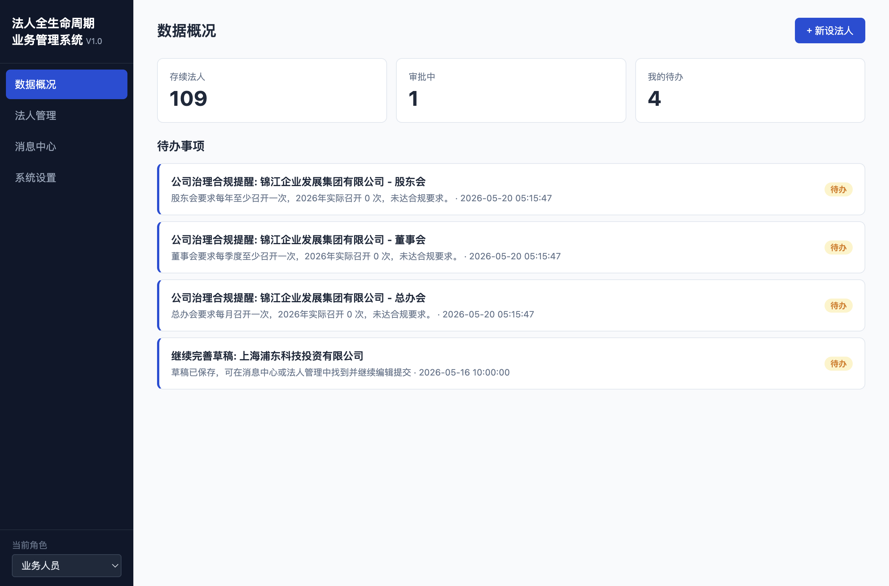
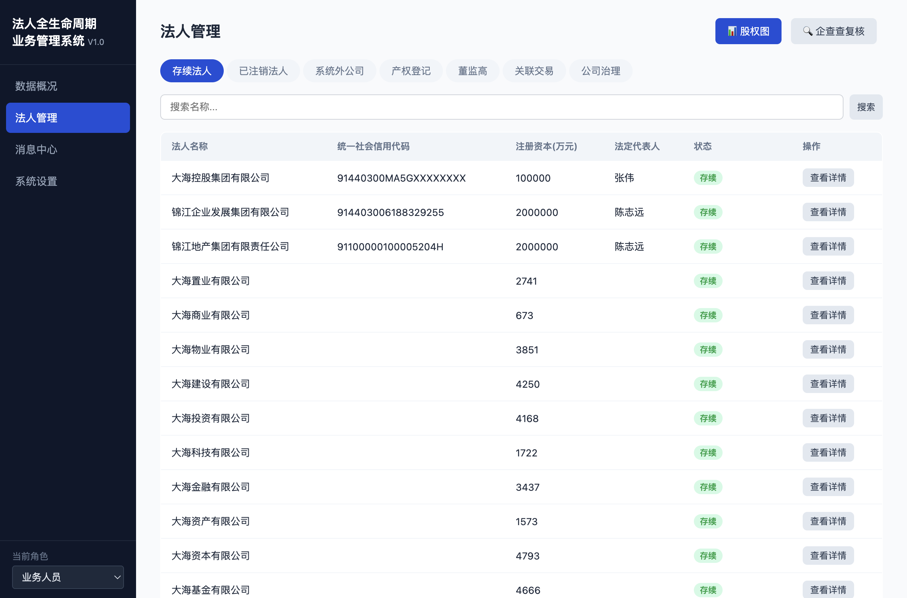

# 法人全生命周期业务管理系统 V1.0

面向集团法务与合规部门的一站式工作平台。围绕法人从设立到注销的全过程，将审批流程、合规检查与文档分析整合为统一工作台。

## 做什么

- **法人全过程管理** — 从新设审批到注销终止，覆盖法人完整生命周期
- **股权与人员追踪** — 股东结构、董监高任职变动可追溯
- **合规自动化** — 对关键合规节点自动校验、提醒，减少人工遗漏
- **文档智能分析** — 上传文件后自动提取关键信息并比对合规要求

## 技术栈

Node.js · SQLite · 原生 JavaScript 前端 · 大模型集成

## 演示

本仓库仅作功能演示，不含源代码。
